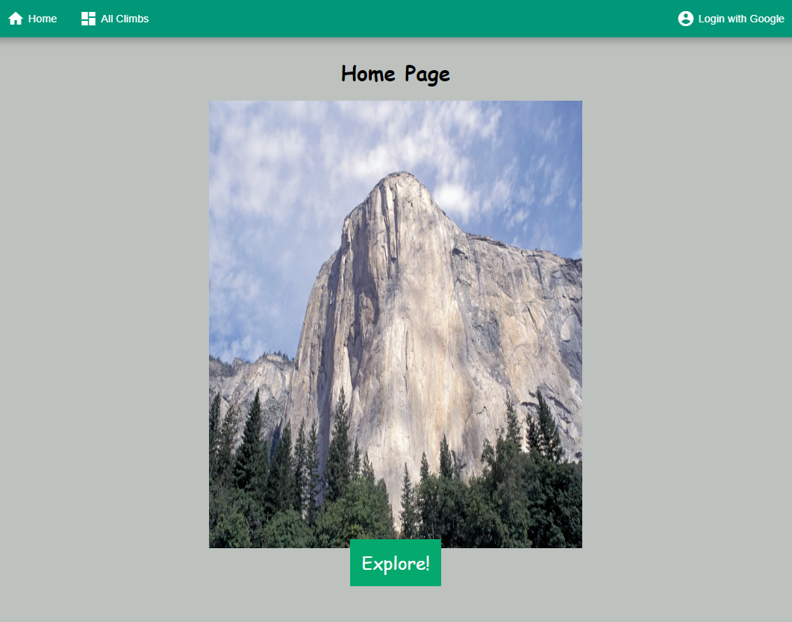
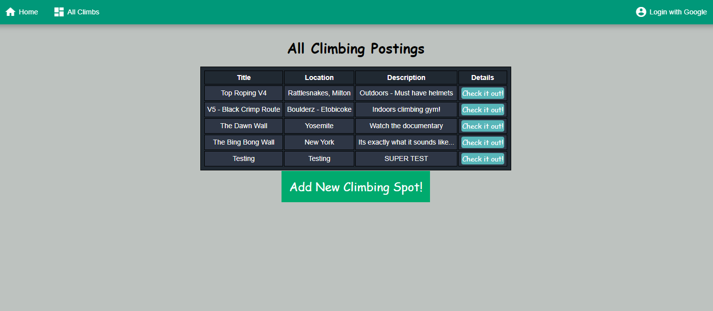

# Project 2: Node/Express/MongoDB Full-Stack CRUD Application

Web application to post different climbing recommendations and allows for users to leave reviews.

 

## Introduction
Rocking climbing is a form of activity involved scaling and/or traversing areas of rock. This activity was born out of the long tradition of mountaineering. There are different forms of rock climbing such as:

- Traditional Climbing (Aka - Trad Climbing)
- Top Roping
- Lead Climbing
- Bouldering

In modern rocking climbing, it is quite common to go to an indoor gym to perform this physical activity however many climbers enjoy going outdoors to experience the real deal. This app will allow users to post their recommendations and other users can provide feedback.

 

## Different Technologies Used
- <b>HTML/CSS/JavaScript</b>
- <b>MongoDB</b>
- <b>Express</b>
- <b>Node.js</b>
- <b>Oauthrization</b>
    

## Screenshots of the Game

Screenshot of Web Application Home Page

 

Display of All posted Climbing Recommendations

 

## Getting Started

Lets get started!
Access the app through the link below:

[Boulder Here - Click Here](https://boulder-here.herokuapp.com/home/)

## Future enhancements
1. Implement imgur image upload API.

2. Allow web application to differentiate between which posts can be editted by the original user.
